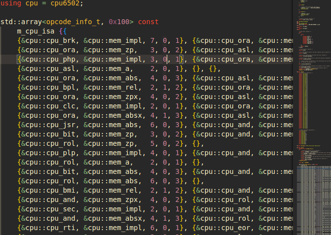

# CPUmos6502-MT-Safe

A 6502 microprocessor implementation in modern C++ 20, implemented with Thread-Safety in mind

> Table: Logical CPU Instructions with Operations Modes

## How to build the test program

Just type:

~~~bash
mkdir build
cd build
CXX=clang++ cmake ..
make
~~~

## Dependencies

- libfmt
- cmake >= 3.16

## Features and code structure

The reference memory layout used and implemented:

~~~c++
/*
6502 Memory layout
    [END ROM]
    [0xffff]
    |INT VECTORS|
    [0xfff4]
    |ROM MEMORY]
    [0x7fff]
    |MAIN RAM|
    [0x01ff]
    |STACK|
    [0x0100]
    |ZERO PAGE|
    [0x0000]
*/
~~~

The default processor status after the reset signal:

~~~c++
/* The status flag after the reset signal */
/* Carry = 1, Zero = 1, IRQ = 1, Decimal = 0, BRK = 1, Reserved = 1, Overflow = 1, Negative = 1 */

constexpr uint8_t RESET_STATUS_SIGNAL = 0xfb;
~~~

## Development interface

Two constructors are provided

The first one uses the read and write functions callback

~~~c++
/* Set this macro to 1 to enable callback capabilities */
#define USE_6502_CALLBACKS 1

/* Functions callback that's needed to be passed to cpu6502 class object */
typedef uint8_t (*cpu_read) (uint16_t);
typedef void (*cpu_write) (uint16_t, uint8_t);
~~~

## Usage example

> Simple example of callback functions

~~~c++
static std::array<uint8_t, MAX_RAM_STORAGE> CPU_RAM{};
static std::array<uint8_t, MAX_ROM_STORAGE> CPU_ROM{};

/* CPU callback functions definition */

uint8_t cpu_6502_read(const uint16_t address)
{
    if (address <= MAX_RAM_STORAGE)
        return CPU_RAM[address];
    return CPU_ROM[address & MAX_RAM_STORAGE];
}

void cpu_6502_write(const uint16_t address, const uint8_t data)
{
    CPU_RAM[address & MAX_RAM_STORAGE] = data;
}

cpu6502 cpu = cpu6502(cpu_6502_read, cpu_6502_write);
~~~

The second needed a ram and rom uint8_t* array pointers

~~~c++
/* If 1, the internal ram is used (I don't needed to provide one)*/
#define USE_INTERNAL_RAM 1
~~~

The clock method, used to execute CPU instructions by the counts of cycles needed to be executed

TIP: Outside a console emulator system u can use a auto generator or try to generate the real cpu 6502 frequency

~~~c++
std::pair<size_t, size_t> cpu6502::clock(size_t cycles_count, size_t &executed_cycles)
~~~

The step method is used to execute only one instruction from the current CPU state, other way the step_count is used to execute one or more instructions and works like the clock method

~~~c++
size_t cpu6502::step(size_t &cycles_wasted);
std::pair<size_t, size_t> step_count(size_t cycles_count, size_t &executed_cycles);
~~~

Some get functions has been implemented for help into the debugging or something else like "stack trace"

~~~c++
auto get_register_a();
auto get_register_x();
auto get_register_y();
auto get_register_pc();
auto get_register_s();
auto get_last_fetched_data();
auto get_last_acceded_address();
~~~
